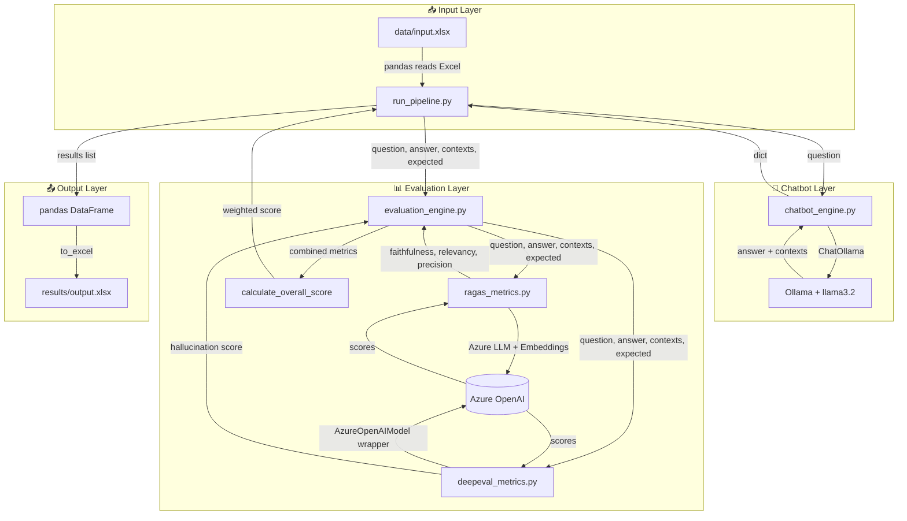
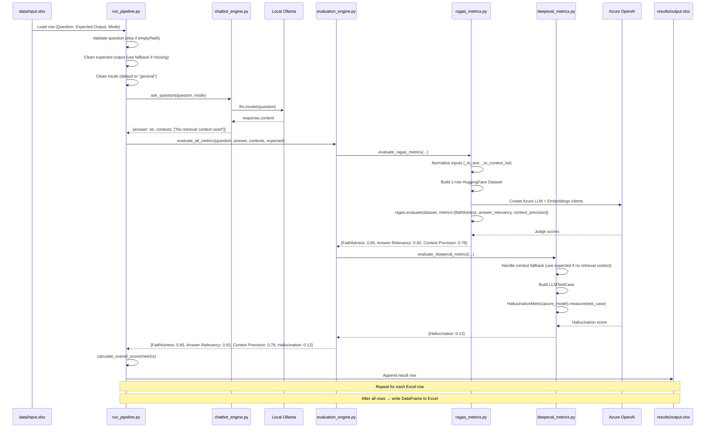
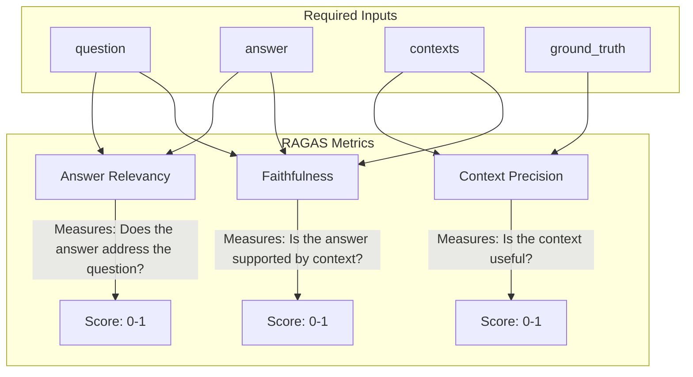
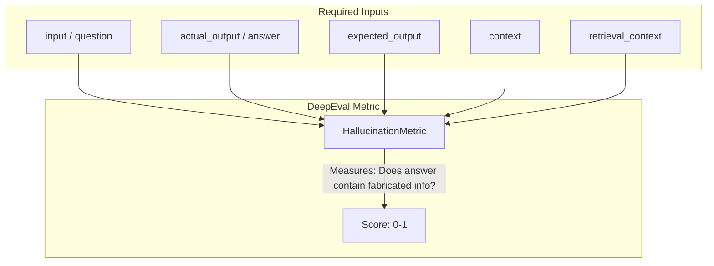
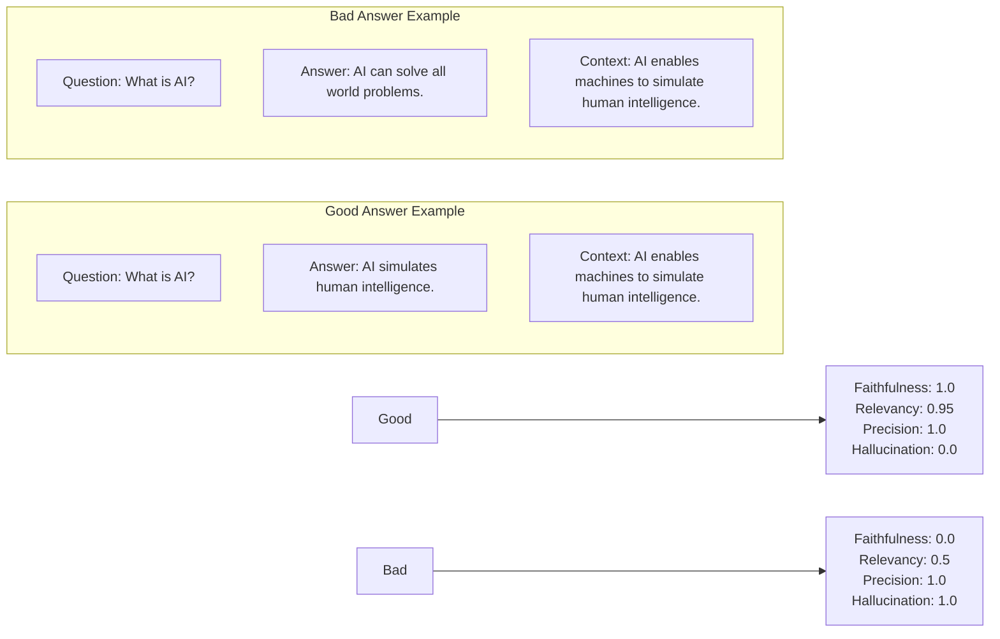
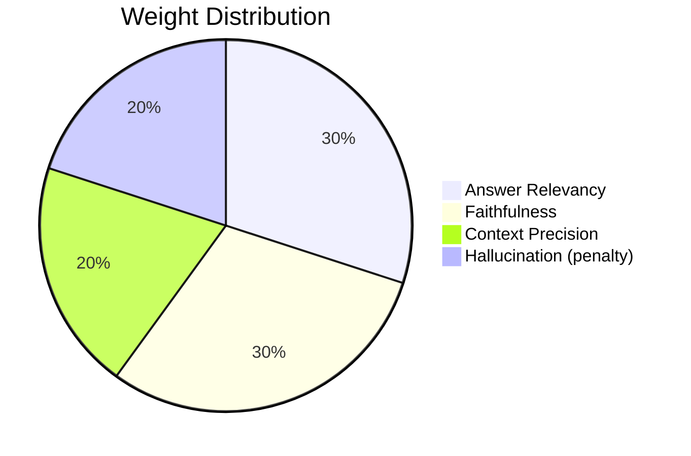

# Chatbot3 — Complete Project Guide

> **Excel-Driven Chatbot Evaluation Pipeline**  
> Read questions from Excel → Ask a local Ollama chatbot → Evaluate answers with RAGAS + DeepEval → Write scores to Excel

---

## Table of Contents

1. [Project Overview](#1-project-overview)
2. [Project Structure](#2-project-structure)
3. [Environment Setup](#3-environment-setup)
4. [How to Run the Project](#4-how-to-run-the-project)
5. [Architecture & Data Flow](#5-architecture--data-flow)
6. [Detailed File-by-File Walkthrough](#6-detailed-file-by-file-walkthrough)
7. [RAGAS — Deep Dive](#7-ragas--deep-dive)
8. [DeepEval — Deep Dive](#8-deepeval--deep-dive)
9. [Azure OpenAI Integration](#9-azure-openai-integration)
10. [Evaluation Metrics Explained](#10-evaluation-metrics-explained)
11. [Scoring Formula](#11-scoring-formula)
12. [Error Handling Strategy](#12-error-handling-strategy)
13. [Current Limitations](#13-current-limitations)
14. [Recommended Improvements](#14-recommended-improvements)

---

## 1. Project Overview

### What Does This Project Do?

This is a **batch-processing pipeline** that:

1. Takes a list of questions from an Excel file (`data/input.xlsx`)
2. Sends each question to a **local Ollama chatbot** running `llama3.2`
3. Evaluates each chatbot answer using two different evaluation frameworks:
   - **RAGAS** — Measures Faithfulness, Answer Relevancy, and Context Precision
   - **DeepEval** — Measures Hallucination
4. Saves all results — question, expected answer, actual answer, all metric scores, and an overall weighted score — into `results/output.xlsx`

### Why Was This Project Built?

The goal is to **automate the evaluation of a chatbot's responses** without manual human review. Instead of reading every chatbot answer yourself, this pipeline:

- Asks predefined questions from a spreadsheet
- Collects the chatbot's answers
- Uses two different AI evaluation frameworks (RAGAS and DeepEval) to score each answer
- Produces a spreadsheet with objective, repeatable quality scores

### Tech Stack

| Component | Technology | Purpose |
|-----------|-----------|---------|
| **Chatbot** | Ollama + `llama3.2` (local LLM) | Generates answers to questions |
| **Chatbot Wrapper** | LangChain (`ChatOllama`) | Python interface to Ollama |
| **Evaluator LLM** | Azure OpenAI (`gpt-4o-mini`) | Acts as judge for RAGAS & DeepEval |
| **Embeddings** | Azure OpenAI (`text-embedding-ada-002`) | Powers RAGAS embedding-based metrics |
| **Evaluation Framework 1** | RAGAS (v0.1.21) | Faithfulness, Answer Relevancy, Context Precision |
| **Evaluation Framework 2** | DeepEval (≥v2.0.0) | Hallucination scoring |
| **Data Handling** | pandas + openpyxl | Read/write Excel files |
| **Configuration** | pydantic + python-dotenv | Manage environment variables |
| **Package Manager** | uv (modern Python package manager) | Dependency resolution & virtual environments |
| **Dataset Format** | HuggingFace `datasets` | RAGAS expects data in this format |

---

## 2. Project Structure

```
chatbot3/
│
├── .env                             # 🔐 Azure OpenAI credentials
├── .python-version                  # Python version pinning (3.12)
├── pyproject.toml                   # uv project config + dependencies
├── requirements.txt                 # Legacy pip requirements (OUTDATED)
├── uv.lock                          # uv lockfile for reproducible builds
├── README.md                        # Single run command
├── run.bat                          # Windows launcher
├── run_pipeline.py                  # 🎯 MAIN ENTRY POINT
├── chatbot_engine.py                # 🤖 Local Ollama chatbot wrapper
├── test_ragas.py                    # Standalone RAGAS demo (real API calls)
├── test_deepeval.py                 # Standalone DeepEval demo (real API calls)
│
├── config/                          # 📋 Configuration modules
│   ├── settings.py                  # Pydantic model for .env variables
│   └── azure_clients.py             # Azure OpenAI client factories
│
├── data/
│   └── input.xlsx                   # 📥 Input: Questions + Expected Outputs
│
├── evaluation/                      # 📊 Evaluation engine
│   ├── evaluation_engine.py         # Orchestrator: runs RAGAS + DeepEval + score calculation
│   ├── ragas_metrics.py             # RAGAS metric runner
│   ├── ragas_config.py              # LEGACY: import-time client creation (unused by pipeline)
│   ├── deepeval_metrics.py          # DeepEval hallucination scoring
│   └── deepeval_config.py           # Azure OpenAI wrapper for DeepEval
│
├── faiss_index/                     # 📦 Vector store artifacts (UNUSED)
│   ├── index.faiss
│   └── index.pkl
│
└── results/
    └── output.xlsx                  # 📤 Output: Questions + Answers + Scores
```

### What Each Directory Is For

| Directory | Purpose |
|-----------|---------|
| `config/` | Centralized configuration — Azure credentials, client factories |
| `data/` | **Input** Excel file goes here |
| `evaluation/` | All evaluation logic — RAGAS, DeepEval, combined scoring |
| `faiss_index/` | **Vector database artifacts** — leftover from a previous RAG-enabled version, **not used currently** |
| `results/` | **Output** Excel file is written here |

---

## 3. Environment Setup

### Step 1: Install Python 3.12+

```bash
# Check your current Python version
python --version

# The project requires Python >= 3.12 (specified in .python-version)
# If you don't have it, download from https://www.python.org/downloads/
```

### Step 2: Install uv (Package Manager)

```bash
# Install uv - a fast Python package manager
pip install uv

# Verify installation
uv --version
```

### Step 3: Create Virtual Environment & Install Dependencies

```bash
# Create virtual environment using uv
uv venv

# Activate it (Windows)
.venv\Scripts\activate

# Activate it (Mac/Linux)
source .venv/bin/activate

# Install all dependencies from pyproject.toml
uv sync
```

> **Note:** uv reads `pyproject.toml` and `uv.lock` to install exact versions of all dependencies. This ensures reproducible builds.

### Step 4: Install Ollama & Download the Model

```bash
# Download and install Ollama from https://ollama.com

# Pull the llama3.2 model used by this project
ollama pull llama3.2

# Verify the model is available
ollama list
```

### Step 5: Configure Azure OpenAI Credentials

Create/update the `.env` file with your Azure OpenAI details:

```env
AZURE_OPENAI_API_KEY=your-api-key-here
AZURE_OPENAI_ENDPOINT=https://your-resource.openai.azure.com/
AZURE_OPENAI_DEPLOYMENT=gpt-4o-mini
AZURE_OPENAI_API_VERSION=2024-12-01-preview
AZURE_OPENAI_EMBEDDING_DEPLOYMENT_NAME=text-embedding-ada-002
```

> ⚠️ **Security Warning:** The `.env` file should be in `.gitignore` and **never committed** to version control, as it contains API keys.

### Step 6: Prepare the Input Excel File

Create `data/input.xlsx` with these columns:

| Question | Expected Output | Mode |
|----------|----------------|------|
| What is AI? | AI refers to systems that simulate human intelligence | general |
| What is machine learning? | Machine learning is a subset of AI... | general |

- **Question** (required): The text sent to the chatbot
- **Expected Output** (optional): The reference/ground truth answer
- **Mode** (optional): Controls chatbot behavior (defaults to "general"; currently unused)

---

## 4. How to Run the Project

### Method 1: Using uv (Recommended)

```bash
uv run python run_pipeline.py
```

`uv run` automatically:
1. Creates/uses the virtual environment in `.venv/`
2. Runs the specified Python script in that environment

### Method 2: Using run.bat (Windows Only)

Simply double-click `run.bat` or run in terminal:

```bash
run.bat
```

The batch file does:
```batch
@echo off
echo Starting Excel evaluation pipeline...
call "%~dp0.venv\Scripts\activate.bat"   # Activate virtual environment
python "%~dp0run_pipeline.py"             # Run the pipeline
pause                                      # Keep window open to see results
```

### Method 3: Manual activation (Any OS)

```bash
# Activate virtual environment
.venv\Scripts\activate        # Windows
source .venv/bin/activate     # Mac/Linux

# Run the pipeline
python run_pipeline.py
```

### What Happens When You Run It

```
[START] Starting Chatbot Evaluation Pipeline...
[INFO] Loaded 5 questions from data/input.xlsx.

Question 1/5: What is AI?
Chatbot Answer: AI is the simulation of human intelligence by machines...
Running RAGAS and DeepEval metrics...
Completed Question 1. Overall Score: 0.72

Question 2/5: What is machine learning?
Chatbot Answer: Machine learning is a subset of AI that enables systems to learn...
Running RAGAS and DeepEval metrics...
Completed Question 2. Overall Score: 0.85

[SUCCESS] Pipeline Completed. Results saved to results/output.xlsx
```

### Output Excel Structure

| Column | Description | Source |
|--------|-------------|--------|
| `Question` | The original question | Cleaned from input Excel |
| `Expected Output` | The reference answer | Cleaned from input Excel or fallback |
| `Actual Output` | The chatbot's generated answer | `chatbot_engine.py` |
| `Faithfulness` | Score (0–1): Is the answer supported by context? | RAGAS |
| `Answer Relevancy` | Score (0–1): Does the answer address the question? | RAGAS |
| `Context Precision` | Score (0–1): Is the context useful/precise? | RAGAS |
| `Hallucination` | Score (0–1): Does the answer contain fabricated info? | DeepEval |
| `Overall Score` | Final weighted score (0–1) | `calculate_overall_score()` |

---

## 5. Architecture & Data Flow

### High-Level Architecture



### Data Flow: One Excel Row End-to-End



### Decision Flow: How Each Row Is Processed

```mermaid
flowchart TD
    Start([Start Pipeline]) --> CheckFiles{Input file exists?}
    CheckFiles -- No --> Error[Print error and exit]
    CheckFiles -- Yes --> ReadExcel[Read data/input.xlsx]
    ReadExcel --> Loop[Start row loop]
    
    Loop --> Validate{Question valid?<br/>(not None, not NaN, not empty)}
    Validate -- No --> Skip[Skipping row warning]
    Skip --> Next[Next row]
    
    Validate -- Yes --> Clean[Clean expected output & mode]
    Clean --> Chatbot[Call ask_question]
    Chatbot --> Eval[Call evaluate_all_metrics]
    
    Eval --> RagasTry{RAGAS succeeds?}
    RagasTry -- Yes --> RagasOK[Use RAGAS scores]
    RagasTry -- No --> RagasFail[Use default scores 0.0]
    RagasOK --> DeepTry{DeepEval succeeds?}
    RagasFail --> DeepTry
    
    DeepTry -- Yes --> DeepOK[Use DeepEval score]
    DeepTry -- No --> DeepFail[Use default score 0.0]
    DeepOK --> Calc[Calculate overall score]
    DeepFail --> Calc
    
    Calc --> Append[Append result to list]
    Append --> Next
    
    Next --> Loop
    Next --> Done{All rows processed?}
    Done -- No --> Validate
    Done -- Yes --> WriteExcel[Write results/output.xlsx]
    WriteExcel --> Finish([Pipeline complete])
```

---

## 6. Detailed File-by-File Walkthrough

### 6.1 `run_pipeline.py` — The Main Orchestrator

**Purpose:** This is the **entry point** of the entire project. It controls the complete workflow.

**What It Does:**

```
1. Loads .env environment variables
2. Checks if data/input.xlsx exists (stops early if missing)
3. Reads the Excel file into a pandas DataFrame
4. Loops through every row:
   a. Validates the question (skips empty/NaN rows)
   b. Cleans expected output (uses fallback if missing)
   c. Cleans mode (defaults to "general")
   d. Calls ask_question() to get chatbot answer
   e. Calls evaluate_all_metrics() to run RAGAS + DeepEval
   f. Calls calculate_overall_score() for weighted score
   g. Appends result dict to results list
5. Creates results/ directory if needed
6. Writes all results to results/output.xlsx
```

**Key Functions:**

| Function | Lines | Purpose |
|----------|-------|---------|
| `run_pipeline()` | 35-181 | The complete workflow — no arguments, no return value |

**Important Code Patterns:**

```python
# Safe column reading — prevents crash if column is missing
question = getattr(row, "Question", None)
expected = getattr(row, "Expected Output", None)
mode = getattr(row, "Mode", "general")
```

```python
# Skip invalid rows — keeps pipeline running
if question is None or pd.isna(question) or not str(question).strip():
    print(f"[WARNING] Skipping row {idx}: Empty Question")
    continue
```

```python
# Fallback for missing expected output
if expected is None or pd.isna(expected):
    expected = "No expected output provided."
```

```python
# Result accumulation — one dict per row
results.append({
    "Question": question,
    "Expected Output": expected,
    "Actual Output": answer,
    "Faithfulness": metrics.get("Faithfulness", 0),
    "Answer Relevancy": metrics.get("Answer Relevancy", 0),
    "Context Precision": metrics.get("Context Precision", 0),
    "Hallucination": metrics.get("Hallucination", 0),
    "Overall Score": overall_score,
})
```

```python
# Write output at the end
output_df = pd.DataFrame(results)
output_df.to_excel(OUTPUT_FILE, index=False)
```

**Why This Design?**
- `run_pipeline()` takes **no arguments** — it's designed to be called directly without any configuration
- Uses `pd.read_excel()` and `pd.DataFrame.to_excel()` — simple, standard pandas I/O
- `itertuples(index=False)` produces **named tuples** — faster than `iterrows()` and gives column access via dot notation

---

### 6.2 `chatbot_engine.py` — The Local Chatbot Adapter

**Purpose:** Sends one question to a local Ollama model and returns the answer.

**The Code:**

```python
from langchain_ollama import ChatOllama

def ask_question(question, mode="general"):
    llm = ChatOllama(
        model="llama3.2",
        temperature=0.3,
    )
    response = llm.invoke(question)
    
    return {
        "answer": response.content,
        "contexts": ["No retrieval context used"]
    }
```

**Why This Shape?**
- The return value is a **dictionary** with `answer` and `contexts` keys
- This matches the input format expected by both RAGAS and DeepEval
- `contexts` is currently a **placeholder** — no document retrieval is implemented
- The placeholder `"No retrieval context used"` triggers fallback logic in both evaluators

**Why `mode` Parameter Exists:**
- It's accepted but **not used** in the current implementation
- It's designed for **future expansion** — for example, different modes could trigger different chatbot personalities or retrieval strategies

**Why `temperature=0.3`:**
- Temperature controls randomness: 0 = deterministic, 1 = very random
- 0.3 is a good balance: slightly creative but still consistent enough for evaluation

---

### 6.3 `config/settings.py` — Azure Configuration

**Purpose:** Centralizes all Azure OpenAI configuration from `.env` into a typed Pydantic object.

**The Settings Model:**

```python
from pydantic import BaseModel
from dotenv import load_dotenv

load_dotenv()

class Settings(BaseModel):
    AZURE_API_KEY: str = os.getenv("AZURE_OPENAI_API_KEY", "")
    AZURE_ENDPOINT: str = os.getenv("AZURE_OPENAI_ENDPOINT", "")
    AZURE_API_VERSION: str = os.getenv("AZURE_OPENAI_API_VERSION", "")
    AZURE_DEPLOYMENT: str = os.getenv("AZURE_OPENAI_DEPLOYMENT", "")
    AZURE_EMBEDDING_DEPLOYMENT: str = os.getenv("AZURE_OPENAI_EMBEDDING_DEPLOYMENT_NAME", "")

settings = Settings()  # Singleton — shared across all modules
```

**Why Pydantic?**
- **Type validation** — fields are typed strings
- **Centralized access** — every module imports `settings` instead of calling `os.getenv()` repeatedly
- **Default empty strings** — lets downstream validation in `azure_clients.py` produce clear error messages

**Note:** `load_dotenv()` is called here AND in `run_pipeline.py`. This is redundant but harmless — the second call simply has no effect.

---

### 6.4 `config/azure_clients.py` — Azure Client Factories

**Purpose:** Creates Azure OpenAI LLM and Embeddings clients with proper validation.

**The `_required_setting` Validator:**

```python
def _required_setting(name: str) -> str:
    value = getattr(settings, name, "")
    value = str(value).strip() if value is not None else ""
    if not value:
        raise ValueError(f"Missing {name}")
    return value
```

This function is the **gatekeeper** — it:
1. Reads a setting by name from the `settings` object
2. Converts it to a trimmed string
3. Raises a clear `ValueError` with the **specific missing setting name** if empty
4. This prevents confusing LangChain errors like "Connection refused" when the real issue is a missing API key

**The `get_azure_llm` Factory:**

```python
def get_azure_llm():
    api_key = _required_setting("AZURE_API_KEY")
    return AzureChatOpenAI(
        azure_endpoint=_required_setting("AZURE_ENDPOINT"),
        api_key=SecretStr(api_key),
        api_version=_required_setting("AZURE_API_VERSION"),
        azure_deployment=_required_setting("AZURE_DEPLOYMENT"),
        temperature=0,  # Deterministic output for evaluation
    )
```

**Why `temperature=0`:**
- Evaluation should be **consistent and repeatable**
- A judge LLM with temperature 0 will give the same score for the same input every time

**Why `SecretStr`:**
- LangChain (and many LLM libraries) expect API keys wrapped in `SecretStr` for security
- It prevents accidental logging or exposure of the key

**The `get_azure_embeddings` Factory:**

```python
def get_azure_embeddings():
    api_key = _required_setting("AZURE_API_KEY")
    return AzureOpenAIEmbeddings(
        azure_endpoint=_required_setting("AZURE_ENDPOINT"),
        api_key=SecretStr(api_key),
        api_version=_required_setting("AZURE_API_VERSION"),
        azure_deployment=_required_setting("AZURE_EMBEDDING_DEPLOYMENT"),
    )
```

**Important:** Both factories use the **same API key** but different deployments — one for chat, one for embeddings.

---

### 6.5 `evaluation/evaluation_engine.py` — The Evaluation Orchestrator

**Purpose:** This is the **bridge** between the main pipeline and the individual metric systems (RAGAS and DeepEval).

**`evaluate_all_metrics()` — The Combined Evaluator:**

```python
def evaluate_all_metrics(question, answer, contexts, expected):
    # 1. Default RAGAS scores (used if RAGAS fails)
    ragas_scores = {
        "Faithfulness": 0.0,
        "Answer Relevancy": 0.0,
        "Context Precision": 0.0,
    }
    
    # 2. Try RAGAS — catch any error so pipeline continues
    try:
        ragas_scores = evaluate_ragas_metrics(question, answer, contexts, expected)
    except Exception as e:
        print(f"[WARNING] RAGAS evaluation failed: {e}")
    
    # 3. Default DeepEval scores
    deepeval_scores = {"Hallucination": 0.0}
    
    # 4. Try DeepEval — catch any error
    try:
        deepeval_scores = evaluate_deepeval_metrics(question, answer, contexts, expected)
    except Exception as e:
        print(f"[WARNING] DeepEval evaluation failed: {e}")
    
    # 5. Merge both score dictionaries
    return {**ragas_scores, **deepeval_scores}
```

**Why try/except here?**
- RAGAS and DeepEval both make **network calls to Azure OpenAI**
- Network failures, timeouts, rate limits, or invalid responses should NOT crash the entire pipeline
- If one evaluator fails, the other still runs, and the row is still written to Excel (with 0.0 scores for the failed evaluator)

**`calculate_overall_score()` — The Weighted Score:**

```python
import math

def calculate_overall_score(metrics):
    weights = {
        "Answer Relevancy": 0.3,
        "Faithfulness": 0.3,
        "Context Precision": 0.2,
        "Hallucination": -0.2,  # Negative weight = penalty
    }
    
    score = 0
    for metric, weight in weights.items():
        val = metrics.get(metric, 0)
        # Handle NaN or None safely
        if val is None or (isinstance(val, float) and math.isnan(val)):
            val = 0
        score += val * weight
    
    # Clamp at 0 (no negative scores) and round to 2 decimal places
    return round(max(score, 0), 2)
```

**Why This Weight Design?**

| Metric | Weight | Why |
|--------|--------|-----|
| Answer Relevancy | **+0.3** | Directly measures if the answer addresses the question — a core quality measure |
| Faithfulness | **+0.3** | Measures if the answer stays truthful to the context — prevents hallucination indirectly |
| Context Precision | **+0.2** | Measures if the context is useful — less critical for non-RAG pipelines |
| Hallucination | **-0.2** | **Penalty** — higher hallucination means lower overall score |

The weights sum to **0.6** (not 1.0) because the hallucination penalty reduces the maximum possible score. This is intentional — a perfect answer (all RAGAS scores = 1.0, hallucination = 0.0) scores 0.8, and a perfect answer with zero hallucination scores the full 0.8.

---

### 6.6 `evaluation/ragas_metrics.py` — RAGAS Integration

**Purpose:** Prepares data for RAGAS evaluation and runs three metrics on one question-answer pair.

**The Helper Functions (Data Normalization Pipeline):**

```mermaid
flowchart LR
    A[Raw Input Values] --> B[_to_text]
    B --> C[_to_context_list]
    C --> D[Dataset.from_dict]
    D --> E[ragas.evaluate]
    E --> F[_ragas_result_to_record]
    F --> G[_score for each metric]
    G --> H[{"Faithfulness", "Answer Relevancy", "Context Precision"}]
```

**`_to_text(value, fallback)` — The Universal Text Sanitizer:**

```python
def _to_text(value, fallback=""):
    if value is None:
        return fallback
    
    # NaN detection: NaN is the only value not equal to itself
    try:
        if value != value:  # NaN check
            return fallback
    except TypeError:
        pass
    
    value = str(value).strip()
    return value if value else fallback
```

This function handles:
- `None` values
- `NaN` (Not a Number — common in Excel empty cells read by pandas)
- Empty strings
- Objects that don't support comparison
- Any type that can be converted to string

**`_to_context_list(contexts, expected)` — The Context Normalizer:**

```python
def _to_context_list(contexts, expected):
    # Handle string input: wrap in list
    if isinstance(contexts, str):
        contexts = [contexts]
    
    # Handle None: use empty list
    if contexts is None:
        contexts = []
    
    # Handle scalar non-list: wrap in list
    if not isinstance(contexts, (list, tuple, set)):
        contexts = [contexts]
    
    # List comprehension: clean each item, keep only non-empty ones
    cleaned_contexts = [
        _to_text(c)
        for c in contexts
        if _to_text(c)
    ]
    
    # Fallback: if no valid context, use expected output
    if not cleaned_contexts or cleaned_contexts == ["No retrieval context used"]:
        cleaned_contexts = [
            _to_text(expected, "No reference context available")]
    
    return cleaned_contexts
```

This function handles:
- Single string → wraps in list
- `None` → empty list
- Scalar numbers → wraps in list
- Lists with empty/None items → filters them out
- The `"No retrieval context used"` marker → falls back to expected output

**`_score(result_dict, key)` — Safe Metric Extraction:**

```python
def _score(result_dict, key):
    value = result_dict.get(key, 0)
    
    try:
        value = float(value)
    except (TypeError, ValueError):
        return 0.0
    
    # NaN check
    if value != value:
        return 0.0
    
    return value
```

**`_ragas_result_to_record(result)` — Convert RAGAS Result to Dict:**

```python
def _ragas_result_to_record(result: Any) -> dict[str, Any]:
    pandas_result: Any = result.to_pandas()
    
    # Handle case where to_pandas returns an iterator
    if not hasattr(pandas_result, "to_dict"):
        pandas_result = next(iter(pandas_result), None)
    
    if pandas_result is None:
        raise ValueError("RAGAS evaluation returned empty result")
    
    records = pandas_result.to_dict(orient="records")
    
    if not records:
        raise ValueError("RAGAS evaluation returned empty result")
    
    return records[0]  # First (and only) row
```

**Why this complexity?**
- `result.to_pandas()` may return a **DataFrame** or an **iterator of DataFrames** depending on the RAGAS version
- This helper handles both cases safely
- Returns the **first row only** because this pipeline evaluates one question at a time

**`evaluate_ragas_metrics()` — The Main Function:**

```python
def evaluate_ragas_metrics(question, answer, contexts, expected):
    # 1. Normalize all inputs
    question = _to_text(question, "No question provided.")
    answer = _to_text(answer, "No answer provided.")
    expected = _to_text(expected, "No expected output provided.")
    contexts = _to_context_list(contexts, expected)
    
    # 2. Build 1-row HuggingFace Dataset
    dataset = Dataset.from_dict({
        "question": [question],
        "answer": [answer],
        "contexts": [contexts],
        "ground_truth": [expected],
    })
    
    # 3. Create Azure evaluator clients
    azure_llm = get_azure_llm()
    azure_embeddings = get_azure_embeddings()
    
    # 4. Run RAGAS evaluation
    result = evaluate(
        dataset=dataset,
        metrics=[
            faithfulness,
            answer_relevancy,
            context_precision,
        ],
        llm=azure_llm,
        embeddings=azure_embeddings,
    )
    
    # 5. Extract and return scores
    result_dict = _ragas_result_to_record(result)
    return {
        "Faithfulness": _score(result_dict, "faithfulness"),
        "Answer Relevancy": _score(result_dict, "answer_relevancy"),
        "Context Precision": _score(result_dict, "context_precision"),
    }
```

**Why a HuggingFace Dataset?**
- RAGAS's `evaluate()` function is designed to work with HuggingFace `Dataset` objects
- Even for a single row, it must be wrapped in a Dataset
- The Dataset expects specific column names: `question`, `answer`, `contexts`, `ground_truth`

**Why `get_azure_llm()` and `get_azure_embeddings()` are called inside this function:**
- **Lazy initialization** — Azure clients are created only when needed
- Avoids import-time failures if Azure is unreachable
- Each call creates a new client (could be optimized to reuse)

---

### 6.7 `evaluation/deepeval_config.py` — Azure Wrapper for DeepEval

**Purpose:** DeepEval expects an LLM that follows its `DeepEvalBaseLLM` interface. This class wraps Azure OpenAI to satisfy that interface.

**The `AzureOpenAIModel` Class:**

```python
from deepeval.models.base_model import DeepEvalBaseLLM
from config.azure_clients import get_azure_llm

class AzureOpenAIModel(DeepEvalBaseLLM):
    def __init__(self):
        self.model = None  # Lazy loading
    
    def load_model(self):
        if self.model is None:
            self.model = get_azure_llm()  # Create once, cache forever
        return self.model
    
    def generate(self, prompt: str) -> str:
        response = self.load_model().invoke(prompt)
        return str(response.content)
    
    async def a_generate(self, prompt: str) -> str:
        response = await self.load_model().ainvoke(prompt)
        return str(response.content)
    
    def get_model_name(self) -> str:
        return "Azure OpenAI"

# Module-level singleton — reused across all metric calls
azure_model = AzureOpenAIModel()
```

**Why This Wrapper Exists:**
- DeepEval by default uses **OpenAI** (the public API)
- This project uses **Azure OpenAI** (a different API)
- The `DeepEvalBaseLLM` interface provides a standardized way to plug in any LLM
- The wrapper translates DeepEval's `generate(prompt)` → Azure's `invoke(prompt)`

**Why Singleton Pattern?**
- `azure_model = AzureOpenAIModel()` is created once at module level
- All DeepEval metric calls share the **same model instance**
- The Azure client is created only once (lazy loading) and cached

---

### 6.8 `evaluation/deepeval_metrics.py` — DeepEval Hallucination Scoring

**Purpose:** Runs DeepEval's `HallucinationMetric` on one question-answer pair.

**The Code:**

```python
def evaluate_deepeval_metrics(question, answer, contexts, expected):
    # 1. Start with the chatbot's contexts
    eval_context = contexts
    
    # 2. Handle missing/placeholder context
    if not eval_context or eval_context == ["No retrieval context used"] or not any(eval_context):
        eval_context = [expected] if expected else ["No reference context available"]
    
    # 3. Build DeepEval test case
    test_case = LLMTestCase(
        input=question,
        actual_output=answer,
        expected_output=expected,
        context=eval_context,
        retrieval_context=eval_context,
    )
    
    # 4. Create hallucination metric with Azure model
    hallucination_metric = HallucinationMetric(model=azure_model)
    
    # 5. Measure and return score
    hallucination_score = hallucination_metric.measure(test_case)
    
    return {"Hallucination": float(hallucination_score)}
```

**The Context Fallback Logic Explained:**

```python
if not eval_context or eval_context == ["No retrieval context used"] or not any(eval_context):
```

This condition catches three scenarios:
| Condition | Meaning |
|-----------|---------|
| `not eval_context` | Context is `None` or empty list `[]` |
| `eval_context == ["No retrieval context used"]` | Chatbot's placeholder (no retrieval) |
| `not any(eval_context)` | List exists but all items are falsy (`""`, `None`, etc.) |

When triggered, it uses the **expected output** as the reference context. This is important because:
- DeepEval's hallucination metric needs **reference material** to determine if the answer contains unsupported claims
- Without it, the metric cannot function

**Why `LLMTestCase` Has These Fields:**
| Field | Content | Used By |
|-------|---------|---------|
| `input` | Original question | Metrics that check if answer addresses the question |
| `actual_output` | Chatbot's answer | The text being evaluated |
| `expected_output` | Ground truth | Reference for comparison |
| `context` | Reference context | Metrics that check context grounding |
| `retrieval_context` | Same as context | Metrics specifically designed for RAG systems |

---

### 6.9 `evaluation/ragas_config.py` — Legacy Import-Time Config

**Purpose:** An older module that creates Azure clients at **import time**.

```python
from config.azure_clients import get_azure_llm, get_azure_embeddings

azure_llm = get_azure_llm()           # Created when module is imported
azure_embeddings = get_azure_embeddings()  # Created when module is imported
```

**⚠️ Design Issue:** Creating Azure clients at import time means:
- Simply importing this module triggers Azure API calls
- If Azure is unreachable, the import fails
- The main pipeline does **not import this module** — it uses `ragas_metrics.py` instead, which creates clients inside the function

**Status:** This module is **legacy** and **not used** by the main pipeline.

---

### 6.10 `test_ragas.py` — Standalone RAGAS Demo

**Purpose:** A standalone script that runs RAGAS on one hardcoded question.

**What It Does:**
```
1. Loads .env
2. Reads Azure credentials directly from os.getenv (not using settings.py)
3. Creates Azure LLM and Embeddings clients
4. Builds a 1-row Dataset with hardcoded sample data
5. Runs RAGAS evaluate()
6. Prints results
```

**Sample Data Used:**
```python
data = {
    "question": ["What is AI?"],
    "answer": ["AI is the simulation of human intelligence by machines."],
    "contexts": [["Artificial Intelligence is the simulation of human intelligence processes by machines."]],
    "ground_truth": ["AI refers to machine systems capable of performing tasks requiring human intelligence."],
}
```

**⚠️ Issue:** This file makes **real API calls** to Azure OpenAI when executed. It cannot be safely used in a test suite.

---

### 6.11 `test_deepeval.py` — Standalone DeepEval Demo

**Purpose:** A standalone script that runs DeepEval hallucination scoring on one hardcoded case.

**What It Does:**
```
1. Loads .env
2. Reads Azure credentials directly from os.getenv
3. Defines its own AzureOpenAIModel class (identical to the one in deepeval_config.py)
4. Creates a test case with hardcoded sample data
5. Runs HallucinationMetric
6. Prints the score
```

**⚠️ Issues:**
- Makes **real API calls** at top level
- **Duplicate code** — the `AzureOpenAIModel` class is defined here AND in `deepeval_config.py`
- **Duplicate safety check** — `AZURE_DEPLOYMENT` is checked twice (lines 91-97 and 101-106)
- Cannot be safely collected by pytest

---

## 7. RAGAS — Deep Dive

### What is RAGAS?

**RAGAS** (Retrieval Augmented Generation Assessment) is an open-source framework for evaluating RAG (Retrieval-Augmented Generation) systems. It uses an evaluator LLM (in this case, Azure OpenAI) to judge the quality of question-answering pairs.

### RAGAS Metrics Used in This Project



### Metric 1: Faithfulness

| Aspect | Details |
|--------|---------|
| **What it measures** | Whether the answer's claims are **supported by** the provided context |
| **How it works** | The evaluator LLM breaks the answer into individual claims, then checks if each claim can be inferred from the context |
| **Score range** | 0.0 (all claims unsupported) to 1.0 (all claims supported) |
| **Why it matters** | A faithful answer doesn't make things up — it sticks to what the context says |
| **Used when** | You have context documents and want to ensure the answer doesn't deviate from them |

### Metric 2: Answer Relevancy

| Aspect | Details |
|--------|---------|
| **What it measures** | Whether the answer is **relevant to** the question asked |
| **How it works** | The evaluator generates hypothetical questions from the answer, then checks how similar they are to the original question (using embeddings) |
| **Score range** | 0.0 (completely irrelevant) to 1.0 (perfectly relevant) |
| **Why it matters** | An answer can be factually correct but completely miss the point of the question |
| **Used when** | You want to ensure the chatbot answers what was actually asked |

### Metric 3: Context Precision

| Aspect | Details |
|--------|---------|
| **What it measures** | Whether the **retrieved context** contains useful/precise information for answering the question |
| **How it works** | The evaluator checks if the relevant information appears early in the context list (earlier = more precise) |
| **Score range** | 0.0 (no useful context) to 1.0 (all context useful) |
| **Why it matters** | In a RAG system, retrieved documents should be focused and relevant |
| **Used when** | You have a retrieval system and want to evaluate its precision |

### RAGAS Data Format

RAGAS expects data in a HuggingFace `Dataset` with these columns:

| Column | Type | Example | Used By |
|--------|------|---------|---------|
| `question` | `str` | "What is AI?" | Answer Relevancy |
| `answer` | `str` | "AI simulates human intelligence..." | Faithfulness, Answer Relevancy |
| `contexts` | `list[str]` | ["AI is the simulation..."] | Faithfulness, Context Precision |
| `ground_truth` | `str` | "AI refers to machine systems..." | Context Precision (reference) |

### How RAGAS Evaluation Looks in Detail

```
Input:
  question: "What is AI?"
  answer: "AI simulates human intelligence using machines."
  contexts: ["Artificial Intelligence enables machines to simulate human intelligence."]
  ground_truth: "AI refers to systems capable of performing intelligent tasks."

Evaluation Process:
  Faithfulness:
    Claims in answer: ["AI simulates human intelligence", "using machines"]
    Check 1: "AI simulates human intelligence" → Supported by context? Yes ✓
    Check 2: "using machines" → Supported by context? Yes ✓
    Score: 1.0

  Answer Relevancy:
    Hypothetical questions from answer: ["What does AI simulate?", "What does AI use?"]
    Similarity to original question: High
    Score: 0.92

  Context Precision:
    Relevant info found at position 1 in context list
    Score: 1.0
```

### RAGAS Version Used

```toml
ragas == 0.1.21
```

**Why this version?** Newer versions of RAGAS may have breaking API changes. Version 0.1.21 is stable and well-tested with this codebase.

---

## 8. DeepEval — Deep Dive

### What is DeepEval?

**DeepEval** is an open-source evaluation framework for LLM applications. It provides pre-built metrics (like Hallucination, Answer Relevancy, Toxicity, etc.) and uses an evaluator LLM to score responses.

### DeepEval Metric Used in This Project



### Metric: Hallucination

| Aspect | Details |
|--------|---------|
| **What it measures** | Whether the answer contains **unsupported or fabricated** claims |
| **How it works** | The evaluator LLM compares each claim in the answer against the provided context. Claims not supported by context are "hallucinations" |
| **Score range** | 0.0 (no hallucination) to 1.0 (completely hallucinated) |
| **Lower is better** | Unlike RAGAS metrics where higher is better, **lower hallucination is better** |
| **Why it penalizes** | Hallucination is dangerous — it means the chatbot is making things up that sound convincing |

### DeepEval Architecture in This Project

```
DeepEval (standard)           → OpenAI API (default)
                              ↓
DeepEval (this project)       → Azure OpenAI API
                              ↓
AzureOpenAIModel wrapper     → DeepEvalBaseLLM interface
(Lazy loads Azure client)    → generate(prompt) → AzureChatOpenAI.invoke(prompt)
(a_generate(prompt))         → AzureChatOpenAI.ainvoke(prompt)
```

### The AzureOpenAIModel Wrapper

DeepEval's `DeepEvalBaseLLM` interface requires these methods:

```python
class DeepEvalBaseLLM:
    def load_model(self) -> Any          # Return the underlying LLM
    def generate(self, prompt: str) -> str  # Synchronous generation
    async def a_generate(self, prompt: str) -> str  # Async generation
    def get_model_name(self) -> str       # Human-readable name
```

Our `AzureOpenAIModel` implements all four:

| Method | Implementation |
|--------|---------------|
| `load_model()` | `get_azure_llm()` → returns `AzureChatOpenAI` instance |
| `generate(prompt)` | `self.load_model().invoke(prompt)` |
| `a_generate(prompt)` | `await self.load_model().ainvoke(prompt)` |
| `get_model_name()` | Returns `"Azure OpenAI"` |

### Hallucination Detection Process

```
Input:
  input: "What is AI?"
  actual_output: "AI is the simulation of human intelligence by machines."
  expected_output: "AI refers to systems capable of performing intelligent tasks."
  context: ["Artificial Intelligence enables machines to simulate human intelligence."]
  retrieval_context: ["Artificial Intelligence enables machines to simulate human intelligence."]

Evaluation Process:
  1. Break answer into claims:
     - "AI is the simulation of human intelligence"
     - "by machines"
  
  2. Check each claim against context:
     - "AI is the simulation of human intelligence" → Supported ✓
     - "by machines" → Supported ✓
  
  3. Calculate: Number of unsupported claims / Total claims
     - 0 unsupported / 2 total = 0.0
  
  Score: 0.0 (no hallucination)
```

### DeepEval Version Used

```toml
deepeval >= 2.0.0
```

---

## 9. Azure OpenAI Integration

### Why Azure OpenAI?

| Requirement | Why |
|-------------|-----|
| **Judge LLM** | RAGAS and DeepEval both need an LLM to act as an evaluator/judge |
| **Deterministic scoring** | Azure OpenAI with temperature=0 gives consistent, repeatable results |
| **Enterprise security** | Azure OpenAI provides managed access, audit logs, and data privacy |

### Azure OpenAI Services Used

| Service | Deployment Name | Purpose |
|---------|----------------|---------|
| **Chat Completion** | `gpt-4o-mini` | Acts as the judge/evaluator LLM for both RAGAS and DeepEval |
| **Text Embeddings** | `text-embedding-ada-002` | Generates embeddings for RAGAS's embedding-dependent metrics (Answer Relevancy) |

### Configuration Flow

```
.env
  ├── AZURE_OPENAI_API_KEY
  ├── AZURE_OPENAI_ENDPOINT
  ├── AZURE_OPENAI_DEPLOYMENT
  ├── AZURE_OPENAI_API_VERSION
  └── AZURE_OPENAI_EMBEDDING_DEPLOYMENT_NAME
        ↓
config/settings.py
  └── Settings class (Pydantic BaseModel)
        ↓
config/azure_clients.py
  ├── _required_setting() — validates settings
  ├── get_azure_llm() — AzureChatOpenAI with temperature=0
  └── get_azure_embeddings() — AzureOpenAIEmbeddings
        ↓
evaluation/ragas_metrics.py
  └── Uses both LLM and Embeddings
        ↓
evaluation/deepeval_config.py
  └── Uses LLM (via AzureOpenAIModel wrapper)
```

### API Version

```
AZURE_OPENAI_API_VERSION=2024-12-01-preview
```

This is a preview API version that supports the latest features of Azure OpenAI. Production systems may want to use a stable version like `2024-10-01-preview` or `2024-06-01`.

---

## 10. Evaluation Metrics Explained

### Comparison Table

| Metric | Framework | What It Measures | Score Direction | Weight in Overall |
|--------|-----------|-----------------|-----------------|-------------------|
| Faithfulness | RAGAS | Is the answer grounded in context? | Higher = Better | +0.3 |
| Answer Relevancy | RAGAS | Does the answer address the question? | Higher = Better | +0.3 |
| Context Precision | RAGAS | Is the context useful/precise? | Higher = Better | +0.2 |
| Hallucination | DeepEval | Does the answer contain fabricated info? | **Lower = Better** | -0.2 (penalty) |

### When Does Each Metric Excel?



### Metric Interaction

The four metrics work together to provide a **multi-dimensional view** of answer quality:

| Scenario | Faithfulness | Relevancy | Precision | Hallucination | Overall |
|----------|:-----------:|:---------:|:---------:|:-------------:|:-------:|
| Perfect answer, perfect context | 1.0 | 1.0 | 1.0 | 0.0 | **0.80** |
| Accurate but off-topic answer | 1.0 | 0.2 | 1.0 | 0.0 | **0.50** |
| Hallucinated answer | 0.0 | 0.8 | 0.0 | 1.0 | **0.04** |
| Empty answer | 0.0 | 0.0 | 0.0 | 0.0 | **0.00** |
| Correct answer, irrelevant context | 0.0 | 0.9 | 0.0 | 0.0 | **0.27** |

---

## 11. Scoring Formula

### The Formula

```
overall = (Answer_Relevancy × 0.3) + (Faithfulness × 0.3) + (Context_Precision × 0.2) + (Hallucination × -0.2)

final = max(overall, 0)    # No negative scores
final = round(final, 2)     # Two decimal places
```

### Why This Formula?



1. **Three positive weights** reward good RAGAS scores (total: +0.8)
2. **One negative weight** penalizes hallucination (-0.2)
3. **Maximum possible score**: 1.0 (when all RAGAS=1.0 and hallucination=0.0)
4. **Clipping at zero**: prevents a highly hallucinated answer from producing a confusing negative score

### Score Calculation Example

```python
metrics = {
    "Faithfulness": 0.85,
    "Answer Relevancy": 0.92,
    "Context Precision": 0.78,
    "Hallucination": 0.12,
}

score = (0.92 × 0.3) + (0.85 × 0.3) + (0.78 × 0.2) + (0.12 × -0.2)
     = 0.276 + 0.255 + 0.156 + (-0.024)
     = 0.663

final = round(max(0.663, 0), 2)
     = 0.66
```

---

## 12. Error Handling Strategy

### The 5-Layer Defense

```mermaid
graph TD
    subgraph "Layer 1: File Validation"
        A1[run_pipeline.py checks if input file exists]
        A2[Prints error and returns early if missing]
    end
    
    subgraph "Layer 2: Row Validation"
        B1[run_pipeline.py checks for empty/NaN questions]
        B2[Skips bad rows with warning]
    end
    
    subgraph "Layer 3: Data Normalization"
        C1[ragas_metrics.py has _to_text and _to_context_list]
        C2[Converts any type to safe string/list]
    end
    
    subgraph "Layer 4: Evaluation Failure"
        D1[evaluation_engine.py wraps RAGAS and DeepEval in try/except]
        D2[Falls back to 0.0 scores on failure]
    end
    
    subgraph "Layer 5: Score Safety"
        E1[_score() and calculate_overall_score() handle NaN/None]
        E2[Returns 0.0 for invalid metrics]
    end
```

### Error Scenarios & Responses

| Scenario | Layer | What Happens |
|----------|-------|-------------|
| Input file `data/input.xlsx` missing | 1 | Pipeline prints error and exits gracefully |
| One row has empty question | 2 | Row is skipped, pipeline continues |
| Expected output column missing | 2 | Falls back to "No expected output provided." |
| Chatbot fails to answer | 3 | Answer becomes empty string, evaluation still runs |
| RAGAS evaluation fails (network, timeout, etc.) | 4 | Warning printed, default 0.0 scores used |
| DeepEval evaluation fails | 4 | Warning printed, default 0.0 score used |
| Metric value is NaN or None | 5 | Treated as 0.0 in calculations |
| Azure credentials missing | 1 (config) | `_required_setting()` raises clear ValueError |

---

## 13. Current Limitations

### Critical Issues

| Issue | Location | Impact |
|-------|----------|--------|
| **No document retrieval** | `chatbot_engine.py` | Context is a hardcoded placeholder `["No retrieval context used"]`. RAGAS context metrics (faithfulness, context_precision) operate on **meaningless** context |
| **FAISS vector store exists but unused** | `faiss_index/` directory | Artifacts from a previous RAG-enabled version exist but no pipeline connects them |
| **API keys in `.env` committed** | Root directory | Security risk — `.env` should be in `.gitignore` |

### Design Issues

| Issue | Impact |
|-------|--------|
| `ragas_config.py` creates Azure clients at import time | Triggers API calls on import; not used by main pipeline but could be imported accidentally |
| `test_ragas.py` and `test_deepeval.py` make real Azure calls at top level | Cannot be used with `pytest`; not isolated unit tests |
| `requirements.txt` out of sync with `pyproject.toml` | Missing deepeval, ragas, datasets, tiktoken, posthog |
| Duplicate `load_dotenv()` calls | Redundant but harmless |
| `mode` parameter in chatbot is ignored | Parameter accepted but no behavioral branching |

### Performance Issues

| Issue | Impact |
|-------|--------|
| Sequential row processing | No parallelism for multiple Excel rows |
| Azure client created per row (in RAGAS) | Unnecessary overhead — could be cached |
| No connection pooling or retry | Azure failures can cause metric warnings |

---

## 14. Recommended Improvements

### Short-Term (Quick Wins)

1. **Add `.env` to `.gitignore**
   ```bash
   echo ".env" >> .gitignore
   ```

2. **Rename test files to prevent pytest collection**
   ```bash
   mv test_ragas.py demo_ragas.py
   mv test_deepeval.py demo_deepeval.py
   ```

3. **Remove unused dependencies**
   ```toml
   # Remove from pyproject.toml:
   chromadb
   faiss-cpu
   google-generativeai
   langchain-google-genai
   streamlit
   PyPDF2
   ```

4. **Update requirements.txt to match pyproject.toml** or delete it

### Medium-Term

5. **Add actual document retrieval**
   - Connect the FAISS index to the chatbot
   - Populate `contexts` with real retrieved documents
   - This makes Faithfulness and Context Precision metrics meaningful

6. **Cache Azure clients across rows**
   - Move `get_azure_llm()` and `get_azure_embeddings()` outside the row loop
   - Creates clients once, reuses for all evaluations

### Long-Term

7. **Add logging to file**
   ```python
   import logging
   logging.basicConfig(filename="pipeline.log", level=logging.INFO)
   ```

8. **Command-line arguments**
   ```python
   import argparse
   parser = argparse.ArgumentParser()
   parser.add_argument("--input", default="data/input.xlsx")
   parser.add_argument("--output", default="results/output.xlsx")
   args = parser.parse_args()
   ```

9. **Parallel processing for multiple rows**
   - Use `concurrent.futures` to evaluate multiple rows simultaneously

10. **Add proper unit tests**
    - Test `_to_text()`, `_to_context_list()`, `_score()` in isolation
    - Mock Azure calls for evaluation tests

---

## Appendix: All Terminal Commands

### Setup Commands

```bash
# 1. Check Python version
python --version

# 2. Install uv package manager
pip install uv

# 3. Clone/enter project directory
cd chatbot3

# 4. Create virtual environment
uv venv

# 5. Activate virtual environment (Windows)
.venv\Scripts\activate

# 5. Activate virtual environment (Mac/Linux)
source .venv/bin/activate

# 6. Install all dependencies
uv sync

# 7. Install Ollama
# Download from https://ollama.com

# 8. Pull the llama3.2 model
ollama pull llama3.2

# 9. Verify model is available
ollama list
```

### Run Commands

```bash
# Run the pipeline (uv method — recommended)
uv run python run_pipeline.py

# Run the pipeline (manual activation)
.venv\Scripts\activate
python run_pipeline.py

# Run the pipeline (Windows batch)
run.bat

# Run standalone demo scripts (requires activated venv)
python test_ragas.py
python test_deepeval.py
```

### Development Commands

```bash
# Generate uv.lock from pyproject.toml
uv lock

# Add a new dependency
uv add package-name

# Update all dependencies
uv sync --upgrade

# Check dependency tree
uv tree
```

---

> **End of Project Guide**  
> This document covers the complete `chatbot3` project — from architecture to individual function implementations, from RAGAS and DeepEval theory to practical scoring formulas. Use it as a reference for understanding, running, and extending the project.