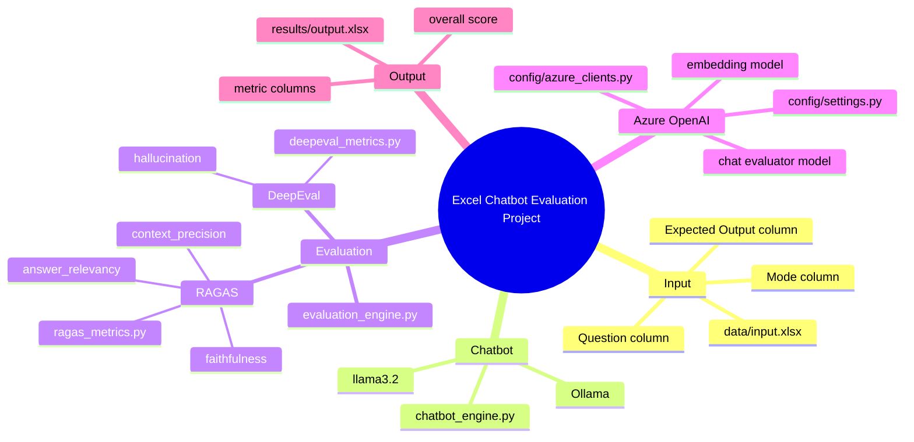
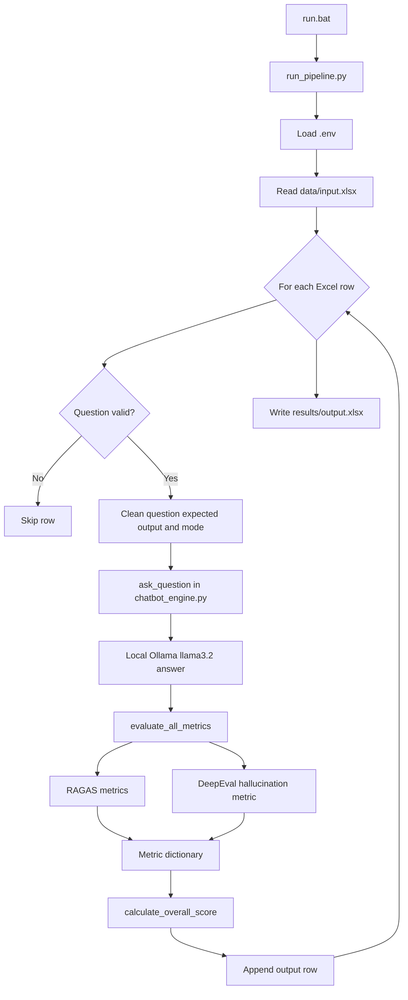
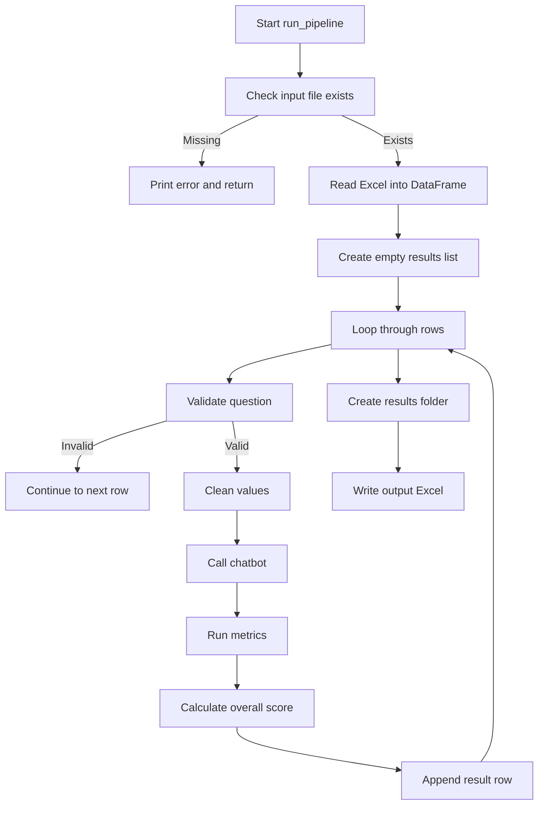
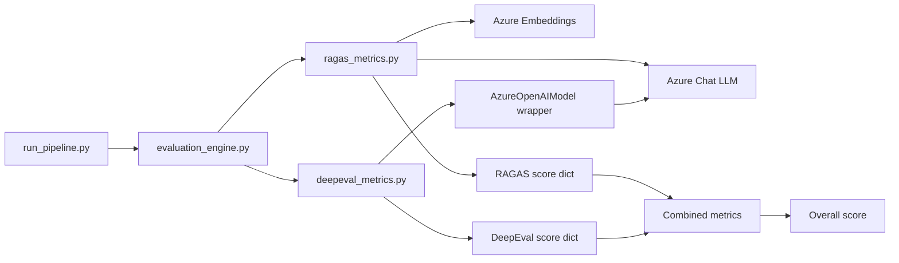
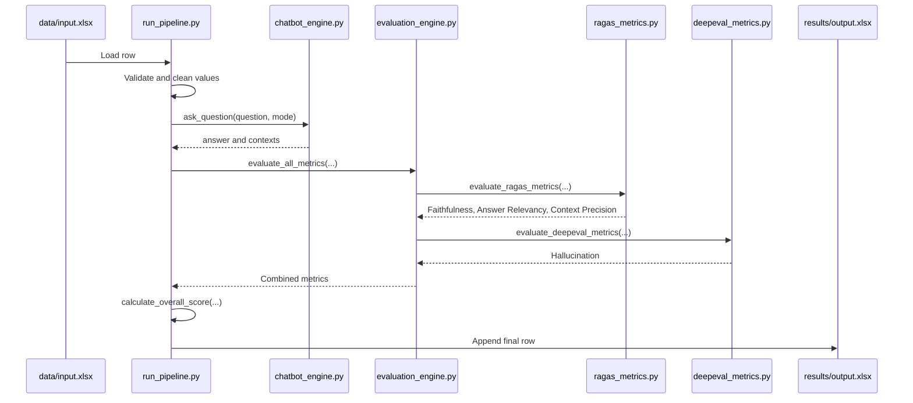

# Project Code Walkthrough

This document explains the complete project workflow, the purpose of each Python file, and the important lines, functions, loops, conditions, and data structures used in the codebase.

The project is a non-UI Excel evaluation pipeline:

1. Read questions from `data/input.xlsx`.
2. Send each question to a local Ollama chatbot.
3. Evaluate each chatbot answer with RAGAS and DeepEval.
4. Save the question, expected answer, actual answer, metrics, and final score into `results/output.xlsx`.

## High-Level Mind Map



## Runtime Flow Diagram



## Main Files

| File | Purpose |
| --- | --- |
| `run_pipeline.py` | Main entry point for the Excel-to-answer-to-evaluation workflow. |
| `chatbot_engine.py` | Sends one question to the local Ollama model and returns an answer. |
| `config/settings.py` | Loads Azure OpenAI settings from `.env`. |
| `config/azure_clients.py` | Creates Azure OpenAI chat and embeddings clients. |
| `evaluation/evaluation_engine.py` | Combines RAGAS and DeepEval scores and calculates final score. |
| `evaluation/ragas_metrics.py` | Runs RAGAS metrics for one question-answer pair. |
| `evaluation/deepeval_config.py` | Wraps Azure OpenAI so DeepEval can use it as its evaluator model. |
| `evaluation/deepeval_metrics.py` | Runs DeepEval hallucination scoring for one question-answer pair. |
| `evaluation/ragas_config.py` | Older/simple RAGAS Azure client config module. |
| `test_ragas.py` | Standalone RAGAS demo/test script. |
| `test_deepeval.py` | Standalone DeepEval demo/test script. |

## Batch File

`run.bat` is the Windows launcher.

```bat
@echo off
echo Starting Excel evaluation pipeline...
call "%~dp0.venv\Scripts\activate.bat"
python "%~dp0run_pipeline.py"
pause
```

Line-by-line:

| Line | Explanation |
| --- | --- |
| `@echo off` | Keeps the terminal output clean by not printing each command before it runs. |
| `echo Starting Excel evaluation pipeline...` | Shows a human-readable start message. |
| `call "%~dp0.venv\Scripts\activate.bat"` | Activates the project virtual environment located in `.venv`. `%~dp0` means the folder where `run.bat` lives. |
| `python "%~dp0run_pipeline.py"` | Runs the Python pipeline script directly. This is the correct non-UI workflow. |
| `pause` | Keeps the terminal window open after the script finishes so the user can read the result or errors. |

## `run_pipeline.py`

This is the most important file. It controls the whole workflow.

### Imports and Constants

| Lines | Code Area | What It Does |
| --- | --- | --- |
| 1-6 | `os`, `pandas`, `load_dotenv` imports | Adds file/folder handling, Excel reading/writing, and `.env` loading. |
| 8-16 | Project imports | Imports the chatbot function and evaluation helpers. |
| 21-22 | `load_dotenv()` | Loads `.env` so Azure and model settings are available before evaluation starts. |
| 24-27 | `INPUT_FILE`, `OUTPUT_FILE` | Defines the fixed Excel input and output paths. |

### `run_pipeline()`

Purpose: run the complete batch workflow without any UI.



Key line groups:

| Lines | Explanation |
| --- | --- |
| 35 | Defines `run_pipeline()`. This keeps the workflow reusable and callable from the `if __name__ == "__main__"` block. |
| 37 | Prints a start message so the terminal confirms the pipeline began. |
| 41-45 | Checks whether `data/input.xlsx` exists. If not, it prints an error and exits safely. This prevents a pandas file-not-found crash. |
| 48 | Reads the Excel file into a pandas DataFrame. Each Excel row becomes one DataFrame row. |
| 50 | Creates `results`, an empty list. Each processed row appends one dictionary into this list. |
| 53 | Prints how many rows were loaded. |
| 59 | Starts the main loop: `for idx, row in enumerate(df.itertuples(index=False))`. This loop processes every Excel row one at a time. |
| 62-66 | Reads `Question`, `Expected Output`, and `Mode` from the current row. `getattr` prevents crashes if a field is missing. |
| 72-76 | Skips empty questions. This avoids sending blank input to the chatbot/evaluators. |
| 79 | Converts the question to trimmed text. |
| 85-90 | Cleans expected output. If missing, a fallback string is used. |
| 96-101 | Cleans mode. If missing, it defaults to `"general"`. |
| 107 | Prints progress using `idx + 1` because users count rows from 1, not 0. |
| 110 | Calls `ask_question(question, mode=mode)` from `chatbot_engine.py`. |
| 113-115 | Safely extracts `answer` and `contexts` from the chatbot response dictionary. |
| 127-136 | Calls `evaluate_all_metrics(...)`, which runs RAGAS and DeepEval. |
| 139 | Calls `calculate_overall_score(metrics)` to produce one final score. |
| 145-162 | Appends one result dictionary into the `results` list. This dictionary becomes one row in the output Excel file. |
| 173 | Creates the `results` folder if needed. |
| 176 | Converts all result dictionaries into a DataFrame. |
| 178 | Writes `results/output.xlsx`. |
| 189-191 | Runs the pipeline only when this file is executed directly. |

### Main Loop Explanation

The loop on line 59 is necessary because Excel contains multiple questions. The pipeline should answer and evaluate each row independently. If one row is bad, the code can skip or fallback for that row without stopping the whole file.

Loop variables:

| Variable | Meaning |
| --- | --- |
| `idx` | Zero-based row number used for progress messages. |
| `row` | A named tuple containing values from one Excel row. |
| `question` | Text to send to the chatbot. |
| `expected` | Ground truth/reference answer from Excel. |
| `mode` | Optional mode for future chatbot behavior. |
| `answer` | Chatbot output. |
| `contexts` | Retrieval context list. Currently this is a fallback because retrieval is not active. |
| `metrics` | Dictionary returned by RAGAS and DeepEval. |
| `overall_score` | Final weighted score. |

## `chatbot_engine.py`

This file has one job: answer a single question.

### Line Groups

| Lines | Explanation |
| --- | --- |
| 1-2 | Imports `ChatOllama`, the LangChain wrapper for a local Ollama model. |
| 11 | Defines `ask_question(question, mode="general")`. |
| 14-19 | Creates the local model client using `llama3.2` and temperature `0.3`. |
| 22 | Sends the question to Ollama with `llm.invoke(question)`. |
| 25-34 | Returns a dictionary containing answer text and context list. |

### `ask_question(question, mode="general")`

Purpose: receive one question and return a response in the shape expected by the pipeline.

Return shape:

```python
{
    "answer": response.content,
    "contexts": ["No retrieval context used"]
}
```

Why this shape matters:

| Key | Why It Exists |
| --- | --- |
| `answer` | The pipeline writes it to Excel and sends it to evaluators. |
| `contexts` | RAGAS and DeepEval expect context/reference material. Since retrieval is not active, a placeholder is used. |

## `config/settings.py`

This file loads `.env` values into a structured settings object.

### Line Groups

| Lines | Explanation |
| --- | --- |
| 1-6 | Imports `os`, `BaseModel`, and `load_dotenv`. |
| 9 | Loads `.env` into environment variables. |
| 13 | Defines the `Settings` class. |
| 15 | Reads `AZURE_OPENAI_API_KEY`. |
| 17 | Reads `AZURE_OPENAI_ENDPOINT`. |
| 19 | Reads `AZURE_OPENAI_API_VERSION`. |
| 21 | Reads `AZURE_OPENAI_DEPLOYMENT`. |
| 23-26 | Reads `AZURE_OPENAI_EMBEDDING_DEPLOYMENT_NAME`. |
| 30 | Creates a shared `settings` instance. |

### `Settings` Class

Purpose: centralize environment variables so other modules do not repeatedly call `os.getenv`.

Important behavior:

| Behavior | Reason |
| --- | --- |
| Uses empty string defaults | Lets client code detect missing values and raise clearer errors. |
| Uses Pydantic `BaseModel` | Gives a structured object with typed fields. |
| Creates `settings = Settings()` | Makes one shared config object importable everywhere. |

## `config/azure_clients.py`

This file creates Azure OpenAI clients for evaluation.

### `_required_setting(name: str) -> str`

Purpose: read one setting and ensure it exists.

Line groups:

| Lines | Explanation |
| --- | --- |
| 10 | Function definition. |
| 12 | Uses `getattr(settings, name, "")` to read a setting dynamically. |
| 14 | Converts the value to a trimmed string. |
| 16-18 | Raises `ValueError` if the setting is missing. |
| 20 | Returns the valid setting. |

Why this function exists:

It prevents confusing Azure/LangChain errors by failing early with messages like `Missing AZURE_API_KEY`.

### `get_azure_llm()`

Purpose: create the Azure chat model used by RAGAS and DeepEval.

Line groups:

| Lines | Explanation |
| --- | --- |
| 24 | Function definition. |
| 26 | Reads the API key using `_required_setting`. |
| 29-40 | Builds `AzureChatOpenAI`. |
| 31 | Supplies Azure endpoint. |
| 33 | Wraps API key with `SecretStr`. |
| 35 | Supplies API version. |
| 37 | Supplies chat deployment name. |
| 39 | Uses `temperature=0` for deterministic evaluator behavior. |

### `get_azure_embeddings()`

Purpose: create the Azure embeddings client used by RAGAS.

Line groups:

| Lines | Explanation |
| --- | --- |
| 44 | Function definition. |
| 46 | Reads API key. |
| 49-58 | Builds `AzureOpenAIEmbeddings`. |
| 57 | Uses embedding deployment name. |

## Evaluation Architecture



## `evaluation/evaluation_engine.py`

This file is the bridge between the pipeline and individual metric systems.

### `evaluate_all_metrics(question, answer, contexts, expected)`

Purpose: run RAGAS and DeepEval, catch failures, and return one combined dictionary.

Line groups:

| Lines | Explanation |
| --- | --- |
| 12-20 | Function definition and parameters. |
| 23-30 | Creates default RAGAS scores. |
| 33-44 | Tries to run `evaluate_ragas_metrics`. |
| 46-48 | Catches RAGAS errors and prints a warning. |
| 51-54 | Creates default DeepEval scores. |
| 57-68 | Tries to run `evaluate_deepeval_metrics`. |
| 70-72 | Catches DeepEval errors and prints a warning. |
| 75-80 | Merges RAGAS and DeepEval dictionaries. |
| 83 | Returns combined metrics. |

Why try/except is used:

Evaluation systems can fail due to network issues, Azure errors, invalid context, timeouts, or dependency conflicts. The try/except blocks keep the Excel pipeline running and allow output to still be written.

### `calculate_overall_score(metrics)`

Purpose: turn individual metric values into one final score.

Line groups:

| Lines | Explanation |
| --- | --- |
| 94 | Function definition. |
| 97-106 | Defines weights for each metric. |
| 109 | Starts score at zero. |
| 112 | Loops through each metric and weight. |
| 114 | Reads metric value from the dictionary. |
| 117-119 | Replaces `None` or `NaN` with `0`. |
| 122 | Adds weighted metric contribution. |
| 125 | Returns non-negative rounded score. |

Weight logic:

| Metric | Weight | Meaning |
| --- | ---: | --- |
| Answer Relevancy | `0.3` | Higher is better. |
| Faithfulness | `0.3` | Higher is better. |
| Context Precision | `0.2` | Higher is better. |
| Hallucination | `-0.2` | Higher hallucination is worse, so it reduces score. |

Loop explanation:

The loop uses `weights.items()` so adding/removing metrics later requires changing only the `weights` dictionary. Each metric contributes `value * weight` to the total.

## `evaluation/ragas_metrics.py`

This file prepares one question-answer pair for RAGAS and returns three metrics.

### RAGAS Metrics Used

| Metric | Meaning |
| --- | --- |
| `faithfulness` | Checks if the answer is supported by the context. |
| `answer_relevancy` | Checks if the answer responds to the question. |
| `context_precision` | Checks if the context is useful/precise for answering. |

### `_to_text(value, fallback="")`

Purpose: safely convert unknown input into non-empty text.

Line groups:

| Lines | Explanation |
| --- | --- |
| 28 | Function definition. |
| 30-32 | Returns fallback if value is `None`. |
| 35-43 | Detects `NaN` safely. |
| 46 | Converts value to trimmed string. |
| 48 | Returns cleaned text or fallback. |

Why it exists:

Excel and pandas can produce `NaN`, empty strings, or non-string values. RAGAS expects strings, so this function normalizes inputs before evaluation.

### `_to_context_list(contexts, expected)`

Purpose: make sure context is always a list of usable strings.

Line groups:

| Lines | Explanation |
| --- | --- |
| 52 | Function definition. |
| 54-56 | Wraps a single string into a list. |
| 59-61 | Converts `None` to empty list. |
| 64-66 | Wraps scalar values into a list. |
| 69-76 | List comprehension cleans and filters context values. |
| 79-83 | Uses expected output as fallback context when no retrieval context exists. |
| 86 | Returns final context list. |

List comprehension explanation:

```python
cleaned_contexts = [
    _to_text(c)
    for c in contexts
    if _to_text(c)
]
```

This loop means:

1. For each context item `c`,
2. Convert it to clean text,
3. Keep it only if the clean text is not empty.

### `_score(result_dict, key)`

Purpose: safely read one metric score from a RAGAS result dictionary.

Line groups:

| Lines | Explanation |
| --- | --- |
| 90 | Function definition. |
| 92 | Reads score by key, defaulting to `0`. |
| 95-101 | Converts value to float or returns `0.0`. |
| 104-106 | Converts `NaN` to `0.0`. |
| 109 | Returns valid score. |

### `_ragas_result_to_record(result: Any) -> dict[str, Any]`

Purpose: convert RAGAS result output into one normal dictionary row.

Line groups:

| Lines | Explanation |
| --- | --- |
| 113 | Function definition. |
| 115 | Calls `result.to_pandas()`. |
| 118-120 | Handles versions where `to_pandas()` behaves like an iterator. |
| 123-125 | Fails clearly if no result exists. |
| 128 | Converts DataFrame rows to dictionaries. |
| 131-133 | Fails clearly if DataFrame has no rows. |
| 136 | Returns first row. |

Why this helper was added:

Pylance/type checking reported that `to_pandas()` might return an iterator. This helper handles both real DataFrame and iterator-like forms without changing runtime behavior.

### `evaluate_ragas_metrics(question, answer, contexts, expected)`

Purpose: run RAGAS on one Excel row.

Line groups:

| Lines | Explanation |
| --- | --- |
| 143-151 | Function definition and parameters. |
| 155-161 | Normalizes inputs using helper functions. |
| 164-176 | Builds a one-row Hugging Face Dataset. |
| 179 | Creates Azure chat evaluator model. |
| 181 | Creates Azure embeddings model. |
| 184-200 | Calls `ragas.evaluate(...)`. |
| 203 | Converts result to dictionary. |
| 206-213 | Returns final metric dictionary. |

Dataset shape:

```python
{
    "question": [question],
    "answer": [answer],
    "contexts": [contexts],
    "ground_truth": [expected],
}
```

Why each column is needed:

| Column | Used For |
| --- | --- |
| `question` | Answer relevancy. |
| `answer` | All answer quality metrics. |
| `contexts` | Faithfulness and context precision. |
| `ground_truth` | Reference answer comparison. |

## `evaluation/deepeval_config.py`

This file adapts Azure OpenAI to DeepEval.

### `AzureOpenAIModel`

Purpose: DeepEval expects a model object following `DeepEvalBaseLLM`. This class wraps the Azure chat model in that interface.

Line groups:

| Lines | Explanation |
| --- | --- |
| 10 | Defines `AzureOpenAIModel`. |
| 13-15 | Constructor starts with `self.model = None`. This is lazy loading. |
| 18-24 | `load_model()` creates and caches the Azure model. |
| 27-31 | `generate()` sends a prompt synchronously and returns text. |
| 34-38 | `a_generate()` sends a prompt asynchronously and returns text. |
| 41-43 | `get_model_name()` returns `"Azure OpenAI"`. |
| 47 | Creates `azure_model`, reused by metrics. |

Why lazy loading matters:

The Azure client is created only when DeepEval actually needs it. This avoids import-time failures and makes the project easier to load.

## `evaluation/deepeval_metrics.py`

This file runs DeepEval hallucination scoring.

### `evaluate_deepeval_metrics(question, answer, contexts, expected)`

Purpose: build a DeepEval test case and calculate hallucination score.

Line groups:

| Lines | Explanation |
| --- | --- |
| 22-30 | Function definition and parameters. |
| 36 | Starts with chatbot contexts. |
| 38-40 | Replaces missing/no-retrieval context with expected output. |
| 43-54 | Builds `LLMTestCase`. |
| 57-62 | Creates `HallucinationMetric`. |
| 65-70 | Measures hallucination. |
| 73-79 | Returns score as a dictionary. |

Condition explanation:

```python
if not eval_context or eval_context == ["No retrieval context used"] or not any(eval_context):
```

This condition means:

| Part | Meaning |
| --- | --- |
| `not eval_context` | Context is empty or missing. |
| `eval_context == ["No retrieval context used"]` | Chatbot explicitly says retrieval was not used. |
| `not any(eval_context)` | Context list exists but contains only empty/falsy items. |

Why expected output becomes fallback context:

DeepEval needs reference material for hallucination scoring. If no retrieval context exists, expected output is the best available reference.

## `evaluation/ragas_config.py`

This file creates module-level RAGAS Azure clients.

Line groups:

| Lines | Explanation |
| --- | --- |
| 1-2 | Imports Azure client factories. |
| 8 | Creates `azure_llm`. |
| 14 | Creates `azure_embeddings`. |

Important note:

The newer `evaluation/ragas_metrics.py` creates Azure clients inside `evaluate_ragas_metrics()` instead of relying on this module. This is safer because it avoids client creation during import.

## Standalone Test/Demo Files

These files are useful for manual testing, but they are not the main batch workflow.

### `test_ragas.py`

Purpose: run one hardcoded RAGAS example using Azure OpenAI.

Main sections:

| Section | Purpose |
| --- | --- |
| Imports | Loads dotenv, RAGAS, Azure OpenAI wrappers, and metrics. |
| Environment variables | Reads Azure config directly from `.env`. |
| Safety checks | Raises errors if required Azure values are missing. |
| Azure LLM | Creates chat evaluator model. |
| Azure embeddings | Creates embedding model. |
| Test data | Defines one sample question-answer-context-ground-truth row. |
| Dataset | Converts sample data into RAGAS Dataset. |
| Evaluation | Runs RAGAS metrics. |
| Print | Displays result in terminal. |

Important caution:

This file makes real Azure calls when executed. It is not just a unit test.

### `test_deepeval.py`

Purpose: run one hardcoded DeepEval hallucination example using Azure OpenAI.

Main sections:

| Section | Purpose |
| --- | --- |
| Imports | Loads dotenv, Azure wrapper, DeepEval base model, metric, and test case. |
| Environment variables | Reads Azure config directly from `.env`. |
| Safety checks | Raises errors if required Azure values are missing. |
| Type fixes | Converts environment values to strings. |
| `AzureOpenAIModel` | Custom DeepEval wrapper around Azure OpenAI. |
| Test case | Defines one sample input, answer, expected output, and context. |
| Metric | Creates `HallucinationMetric`. |
| Measure | Runs the metric. |
| Print | Displays score in terminal. |

Important caution:

This file executes `metric.measure(test_case)` at top level, so it makes a real Azure call as soon as the file runs. This is why full `pytest` can fail during collection if Azure is unreachable.

## Data Flow Per Excel Row



## Error Handling Strategy

| Location | Error Handling | Why |
| --- | --- | --- |
| `run_pipeline.py` | Checks input file exists. | Prevents crash when Excel file is missing. |
| `run_pipeline.py` | Skips empty questions. | Prevents invalid chatbot/evaluator calls. |
| `evaluation_engine.py` | Catches RAGAS exceptions. | Keeps pipeline running when RAGAS fails. |
| `evaluation_engine.py` | Catches DeepEval exceptions. | Keeps pipeline running when DeepEval fails. |
| `azure_clients.py` | Raises clear missing-setting errors. | Prevents confusing Azure client failures. |
| `ragas_metrics.py` | Converts bad scores to `0.0`. | Prevents NaN/None from corrupting final score. |

## External Services and Dependencies

| Component | Used For |
| --- | --- |
| Ollama | Local chatbot answer generation. |
| `llama3.2` | Local model name used by `ChatOllama`. |
| Azure OpenAI chat deployment | Evaluator LLM for RAGAS and DeepEval. |
| Azure OpenAI embeddings deployment | Embeddings for RAGAS context metrics. |
| pandas | Excel input/output. |
| RAGAS | Faithfulness, answer relevancy, context precision. |
| DeepEval | Hallucination scoring. |
| python-dotenv | Loads `.env`. |

## Required `.env` Values

```env
AZURE_OPENAI_API_KEY=...
AZURE_OPENAI_ENDPOINT=...
AZURE_OPENAI_DEPLOYMENT=...
AZURE_OPENAI_API_VERSION=...
AZURE_OPENAI_EMBEDDING_DEPLOYMENT_NAME=...
```

Meaning:

| Variable | Purpose |
| --- | --- |
| `AZURE_OPENAI_API_KEY` | Authenticates Azure OpenAI calls. |
| `AZURE_OPENAI_ENDPOINT` | Azure OpenAI resource endpoint. |
| `AZURE_OPENAI_DEPLOYMENT` | Chat model deployment name. |
| `AZURE_OPENAI_API_VERSION` | API version for Azure OpenAI. |
| `AZURE_OPENAI_EMBEDDING_DEPLOYMENT_NAME` | Embedding model deployment used by RAGAS. |

## Output Excel Columns

| Column | Source |
| --- | --- |
| `Question` | Cleaned Excel input question. |
| `Expected Output` | Cleaned Excel expected answer. |
| `Actual Output` | Local Ollama chatbot answer. |
| `Faithfulness` | RAGAS. |
| `Answer Relevancy` | RAGAS. |
| `Context Precision` | RAGAS. |
| `Hallucination` | DeepEval. |
| `Overall Score` | Weighted score from `calculate_overall_score`. |

## Overall Score Formula

```text
overall =
    Answer Relevancy * 0.3
  + Faithfulness * 0.3
  + Context Precision * 0.2
  + Hallucination * -0.2
```

Then:

```text
final = round(max(overall, 0), 2)
```

This means:

| Step | Reason |
| --- | --- |
| Positive weights reward good RAGAS scores. | Better answer quality should increase score. |
| Negative hallucination weight penalizes hallucination. | More hallucination should reduce score. |
| `max(score, 0)` prevents negative final scores. | Excel output stays simple and readable. |
| `round(..., 2)` keeps two decimal places. | Scores are easier to read. |

## Current Limitations

1. The chatbot currently does not perform document retrieval. It returns `"No retrieval context used"`.
2. RAGAS and DeepEval both depend on Azure OpenAI being reachable.
3. `test_ragas.py` and `test_deepeval.py` are demo scripts, not isolated unit tests.
4. Full `pytest` may fail because demo scripts make real Azure calls during execution.
5. `evaluation/ragas_config.py` still creates clients at import time, but the main `ragas_metrics.py` path avoids that by creating clients inside the function.

## Recommended Future Improvements

1. Split RAGAS and DeepEval into separate virtual environments if dependency conflicts continue.
2. Move demo scripts out of pytest discovery or rename them, for example `demo_ragas.py` and `demo_deepeval.py`.
3. Add real document retrieval so contexts are meaningful instead of fallback text.
4. Add command-line options for input and output Excel paths.
5. Add logging to a file so long runs can be audited later.

